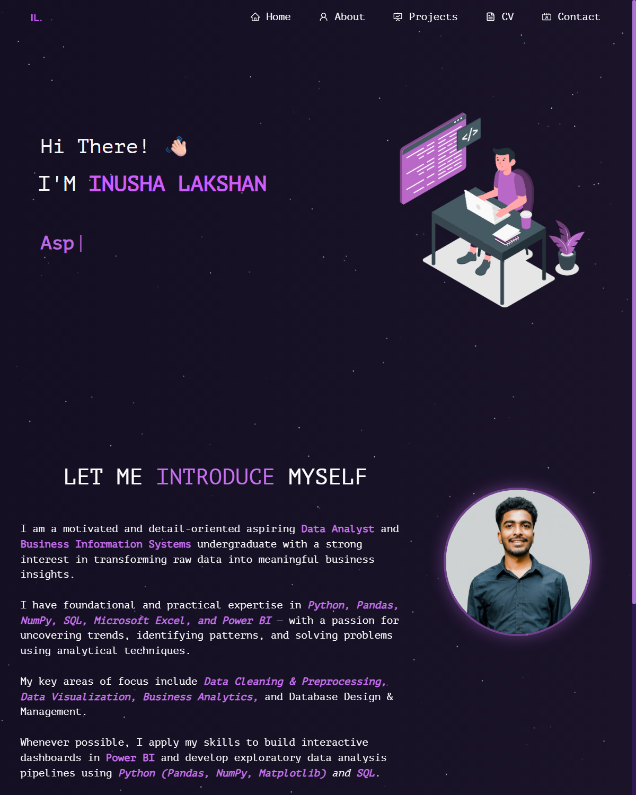

<h1 align="center">
  Inusha Lakshan | Portfolio 🌐<br/>
  <a href="https://inusha-lakshan.vercel.app/" target="_blank">inusha-lakshan.vercel.app</a>
</h1>

<p align="center">
  <b>Aspiring Data Analyst | B.Sc. in Business Information Systems (USJP) | CA Sri Lanka (Capstone Pillar)</b>
</p>

<div align="center">
  
</div>

<br/>

<div align="center">

  [](https://reactjs.org/)
  [](https://getbootstrap.com/)
  [](https://inusha-lakshan.vercel.app/)
  [](https://www.linkedin.com/in/inusha-lakshan/)
  [](https://github.com/Inushalakshan)

</div>

---

## 📌 Overview

Welcome to the repository of my personal portfolio website! This project showcases my academic background, technical skills, data analytics projects, curriculum vitae (CV), and contact channels in an interactive, responsive dark neon aesthetic.

🚀 **Live Deployment:** [https://inusha-lakshan.vercel.app/](https://inusha-lakshan.vercel.app/)

---

## ✨ Features

- **🏠 Home Section:**
  - Interactive hero section with dynamic typewriter role animations.
  - Profile portrait with interactive 3D parallax tilt effects.
  - Floating star particle background via `react-tsparticles`.
- **👤 About Section:**
  - Academic background (B.Sc. in Business Information Systems at University of Sri Jayewardenepura & CA Sri Lanka).
  - Professional skillset badges (Python, Pandas, NumPy, SQL, Excel, Power BI).
  - Development and productivity tools stack.
  - Verified certifications and active GitHub contribution activity calendar.
- **📊 Projects Showcase:**
  - **Telecom Customer Data Analysis & Power BI Dashboard**: End-to-end data exploration, churn insight discovery, and dynamic KPI reporting.
  - **Netflix Exploratory Data Analysis (EDA)**: Content release trend patterns and demographic analysis using Python data science libraries.
- **📄 Curriculum Vitae (CV):**
  - High-resolution in-browser PDF CV reader with zoom/scaling.
  - Instant one-click CV download button.
  - Academic and professional references.
- **📬 Contact Page:**
  - Direct contact cards for **Email**, **Phone**, **GitHub**, and **LinkedIn**.
  - Interactive call-to-action buttons.
- **📱 Fully Responsive & SPA Routing:**
  - Smooth mobile navigation drawer.
  - Client-side routing supported on Vercel via custom URL rewrites (`vercel.json`).

---

## 🛠️ Tech Stack

- **Frontend Library:** [React.js](https://reactjs.org/) (v17.0.2)
- **Styling & Components:** [React-Bootstrap](https://react-bootstrap.github.io/) (v2.2.1), Bootstrap 5, Custom CSS3
- **Routing:** [React Router DOM](https://reactrouter.com/) (v6)
- **Effects & Animations:** `typewriter-effect`, `react-parallax-tilt`, `react-tsparticles`
- **Icons:** [React Icons](https://react-icons.github.io/react-icons/) (`react-icons/ai`, `react-icons/fa`, `react-icons/cg`)
- **Document Viewing:** `@react-pdf/renderer`, `react-pdf`
- **Hosting & Deployment:** [Vercel](https://vercel.com/)

---

## 🚀 Getting Started Locally

To run this project on your local machine:

### Prerequisites
- [Node.js](https://nodejs.org/) (v14 or higher recommended)
- [Git](https://git-scm.com/)

### 1. Clone the repository
```bash
git clone https://github.com/Inushalakshan/InushaLakshan.git
cd InushaLakshan
```

### 2. Install dependencies
```bash
npm install
```

### 3. Start development server
```bash
npm start
```
The application will launch at [http://localhost:3000](http://localhost:3000).

### 4. Build for production
```bash
npm run build
```

---

## 📬 Connect With Me

- **🌐 Website:** [https://inusha-lakshan.vercel.app/](https://inusha-lakshan.vercel.app/)
- **💼 LinkedIn:** [linkedin.com/in/inusha-lakshan](https://www.linkedin.com/in/inusha-lakshan/)
- **🐙 GitHub:** [github.com/Inushalakshan](https://github.com/Inushalakshan)
- **📧 Email:** [inushaacc@gmail.com](mailto:inushaacc@gmail.com)
- **📱 Phone:** [+94 76 889 8584](tel:+94768898584)

---

## 📄 License & Credits

- Designed & Developed by **Inusha Lakshan**.
- Built upon open-source foundations inspired by [Soumyajit Behera](https://github.com/soumyajit4419/Portfolio).
